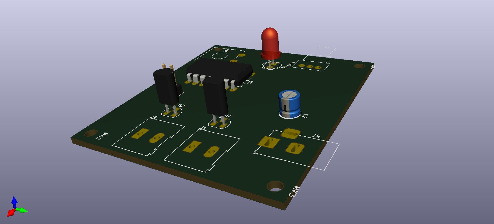
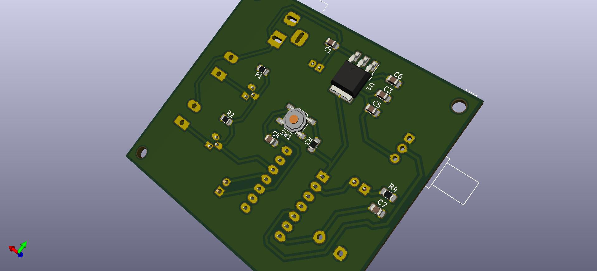

# MSP430_fan_controller

MSP430 based project for controlling 2 12v fans via PWM.
This uses a couple of BS170 NPN Mosfets to do the work.
A potentiometer controls the fan speed.
Schematic included.

